#  AWS Amplify Static Website Hosting Project

##  Overview

This project demonstrates how to **deploy and host a static website** using **AWS Amplify Hosting** backed by **Amazon S3** and **Amazon CloudFront**.
It follows a fully automated Infrastructure-as-Code (IaC) process using **AWS Amplify CLI** and **AWS CloudFormation**, enabling scalable, globally distributed, and secure content delivery.

---
##  Folder Structure Example

```
amplify-static-site/
│
├── amplify/              # Amplify project files (auto-generated)
├── src/ (optional)       # Source files if using frameworks
├── index.html
├── error.html
├── README.md
└── amplify.yml           # (optional) build settings

```

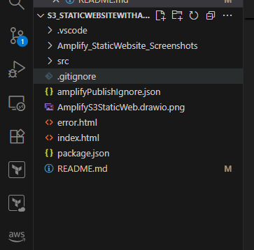


##  Architecture Diagram


### **Architecture Explanation**

**Deployment Flow**

1. The developer uses the Amplify CLI (`amplify hosting add` and `amplify publish`) to initialize and deploy the website.
2. Amplify generates and executes an **AWS CloudFormation** template that provisions all required resources:

   * S3 bucket for static file storage
   * CloudFront distribution for content delivery
3. CloudFormation automatically sets up and links these components, completing the hosting setup.

**Content Delivery Flow**

1. The end user’s browser requests content from the nearest **CloudFront edge location**.
2. CloudFront checks if the requested file (e.g., `index.html`) is cached.

   * If cached → it serves immediately.
   * If not cached → CloudFront retrieves it from S3 (the origin).
3. If the file is found, it is served; otherwise, `error.html` is returned.

---

##  Project Goals

* Learn to deploy and manage a **static website** using **AWS Amplify CLI**
* Understand the interaction between **Amplify**, **CloudFormation**, **S3**, and **CloudFront**
* Demonstrate a **production-grade static site delivery pipeline**
* Showcase **IaC principles** and **DevOps deployment automation** for my portfolio

---

##  Prerequisites

Before starting, ensure you have:

| Tool                 | Purpose                             | Installation Link                                                                                |
| -------------------- | ----------------------------------- | ------------------------------------------------------------------------------------------------ |
| Node.js & npm        | Required to run Amplify CLI         | [Download Node.js](https://nodejs.org)                                                           |
| AWS Account          | To host resources                   | [Sign up for AWS](https://aws.amazon.com)                                                        |
| AWS CLI              | For authentication                  | [Install AWS CLI](https://docs.aws.amazon.com/cli/latest/userguide/getting-started-install.html) |
| Amplify CLI          | To deploy and manage hosting        | Run `npm install -g @aws-amplify/cli`                                                            |
| A basic HTML project | e.g., `index.html` and `error.html` | -                                                                                                |

---

##  Step-by-Step Implementation

Each section below represents a major stage in the project.
 *I will add screenshots after each step to make the README tutorial-rich.*

---

### **Step 1: Install amplify and Initialize Your Project Folder**

Installing the AWS Amplify CLI

Before initializing your project, ensure the Amplify CLI is installed on your system. The CLI allows you to configure, deploy, and manage AWS backend and frontend resources directly from the terminal.

For macOS and Linux Users

Run the following command in your terminal to install the Amplify CLI using cURL:

curl -sL https://aws-amplify.github.io/amplify-cli/install | bash && $SHELL


This script will:

Download and install the latest version of the Amplify CLI

Automatically reload your shell so you can start using amplify immediately

For Windows Users

Run this command in Command Prompt or PowerShell:

curl -sL https://aws-amplify.github.io/amplify-cli/install-win -o install.cmd && install.cmd


If you don’t have cURL installed on your Windows machine:

Visit https://aws-amplify.github.io/amplify-cli/install-win
 in your web browser.

Download the file manually.

Rename it to install-win.cmd.

Double-click or run it from the command line to begin the installation.


Reference

For the official documentation and latest installation instructions, visit:
 AWS Amplify CLI Installation Guide

### **Initializing amplify cli**

```bash
mkdir amplify-static-site
cd amplify-static-site
```

Create your website files:

```bash
touch index.html error.html
```

Example `index.html`:

```html
<!DOCTYPE html>
<html>
<head>
  <title>My Amplify Static Website</title>
</head>
<body>
  <h1>Welcome to My Amplify Project!</h1>
</body>
</html>
```

---

### **Step 2: Configure AWS Amplify CLI**

Initialize Amplify in your project:

```bash
amplify init
```

**What happens here:**

* Amplify sets up a new backend environment in your AWS account.
* You’ll be asked questions like:

  * Project name
  * Environment name (e.g., `dev`)
  * Default editor
  * AWS profile to use (select one you configured with `aws configure`)

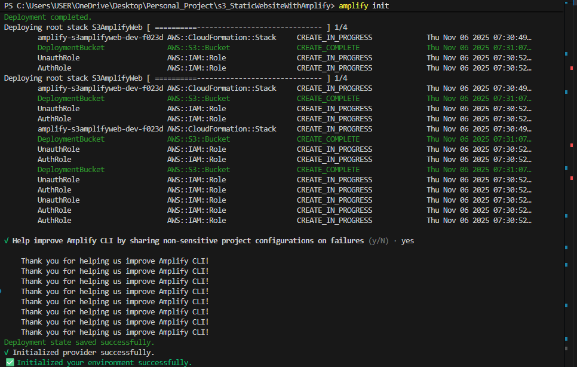


---

### **Step 3: Add Hosting to the Project**

Run:

```bash
amplify hosting add
```

Choose:

* Hosting type: **Managed hosting with Amplify Console**
* Environment: **PROD**
* Index document: `index.html`
* Error document: `error.html`


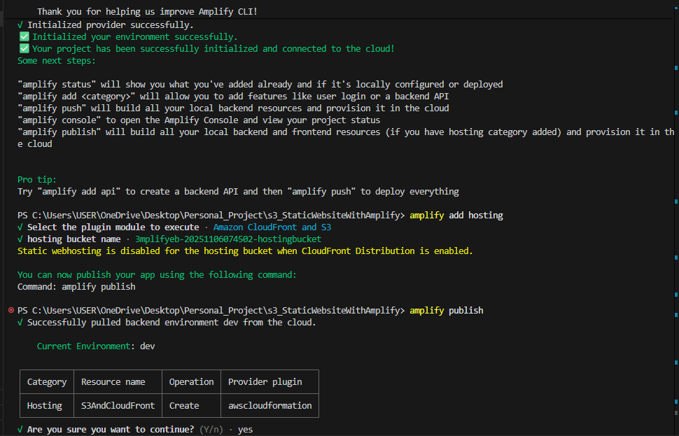


---


### **Step 4: Deploy the Website**

Run the publish command:

```bash
amplify publish
```

**What this does:**

* Builds and uploads your static files to the S3 bucket created by Amplify.
* Provisions and configures a CloudFront distribution.
* Outputs a hosting URL, e.g.:

  ```
  ✔ Hosting endpoint: https://your-app-id.amplifyapp.com
  ```

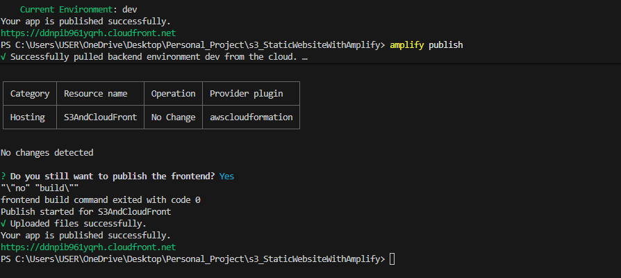


---

### **Step 5: Verify Deployment**

Open the hosting URL in your browser:

```
https://your-app-id.amplifyapp.com
```

You should see your website live.


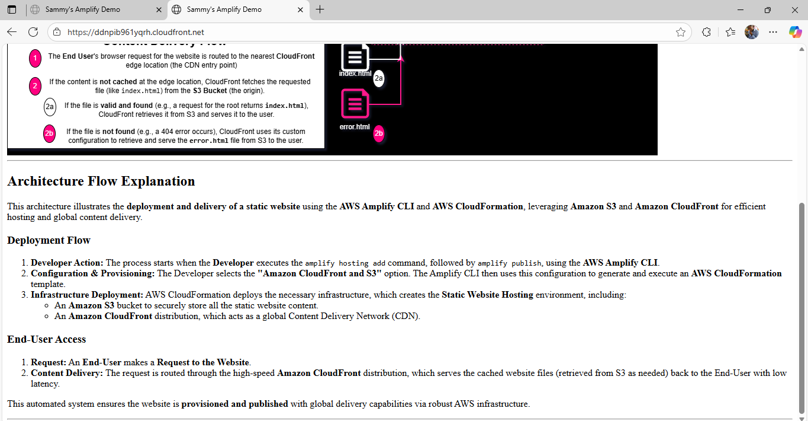


---

Step 6: Make and Redeploy Updates

Whenever you modify index.html or other files, simply run:

amplify publish


Amplify automatically detects file changes, syncs them to S3, invalidates CloudFront cache, and redeploys the latest version.

However, during testing, I noticed that even after redeploying, the updated changes were not immediately visible.
This happened due to CloudFront caching behavior — CloudFront was still serving the old cached version of the website.

To fix this, I manually invalidated the CloudFront cache and then refreshed the browser.
After doing so, the latest changes appeared correctly.


CloudFront Cache Invalidation:


After Cache Invalidation and Refresh:

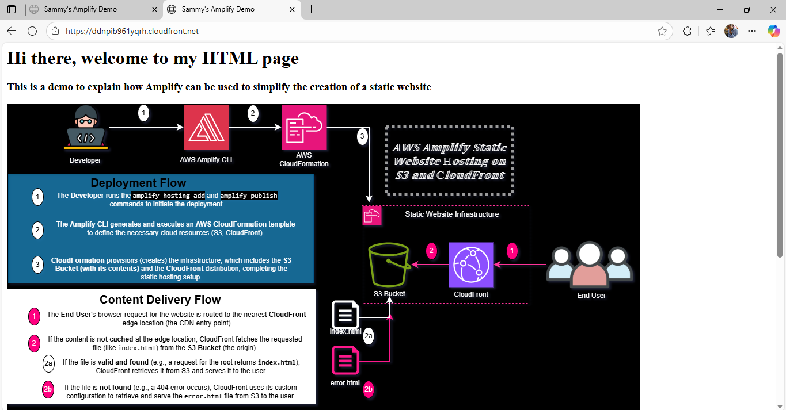
*Updated website after re-deploy.*
New website version displayed correctly after invalidating CloudFront cache


---

##  Understanding What Happens Under the Hood

| Stage          | Service        | Function                                              |
| -------------- | -------------- | ----------------------------------------------------- |
| Amplify CLI    | Developer tool | Automates setup, build, and deployment                |
| CloudFormation | IaC engine     | Creates and manages AWS resources (S3, CloudFront)    |
| S3             | Storage        | Hosts static files like `index.html` and `error.html` |
| CloudFront     | CDN            | Delivers cached content globally for low latency      |

---

##  Common Commands Reference

| Command               | Description                             |
| --------------------- | --------------------------------------- |
| `amplify init`        | Initializes Amplify environment         |
| `amplify hosting add` | Adds hosting configuration              |
| `amplify publish`     | Builds and deploys to Amplify Hosting   |
| `amplify status`      | Shows status of Amplify resources       |
| `amplify delete`      | Deletes all Amplify resources (cleanup) |

---

##  Real-World Relevance

This project simulates a **real DevOps deployment workflow** used by teams hosting static front-end applications such as:

* Portfolio websites
* Product landing pages
* Documentation sites
* Single Page Applications (SPAs)

---
Understanding the .gitignore File

When AWS Amplify initializes your project, it automatically generates a .gitignore file.
This file defines which local files and directories Git should ignore when committing or pushing your project to GitHub.

## The goal is to:

Protect sensitive information (like AWS configuration files)

Keep your repository lightweight

Prevent environment-specific data from being shared

 ### Key Entries Explained
--- 
```bash
Ignored Path	Description
amplify/#current-cloud-backend, amplify/.config/local-*, amplify/logs	Local Amplify environment files that store temporary backend info and logs — specific to your machine and environment.
amplify/mock-*, amplify/backend/.temp	Used for local testing and mock APIs — not needed in production or version control.
build/, dist/	Compiled website files created during build — they can be regenerated, so no need to store them in Git.
node_modules/	Contains thousands of third-party dependencies; these can be reinstalled using npm install.
aws-exports.js, awsconfiguration.json, amplifyconfiguration.json	Auto-generated AWS resource configuration files that may contain API endpoints and IDs. Keeping them private prevents credential leaks.
.secret-*	Ensures secret or token files are never pushed to GitHub.
``` **.sample	Skips placeholder files used for local demos or configuration templates.
 
 Why This Matters

Keeping your .gitignore intact ensures:

Your AWS credentials and configurations remain secure

Your repo stays lightweight and portable

Other developers can clone and initialize the project cleanly with amplify init

You avoid conflicts when multiple environments exist (e.g., dev, test, prod)

Best Practice

Always keep the Amplify-generated .gitignore file unchanged unless you intentionally want to include specific folders.
If you ever add new sensitive files (like .env or private keys), remember to include them in .gitignore.

---


##  Clean-Up (Optional)

To delete all resources and avoid costs:

```bash
amplify delete
```

This command will remove:

* The Amplify project configuration
* S3 bucket
* CloudFront distribution
* CloudFormation stack


All associated Amplify resources successfully removed.
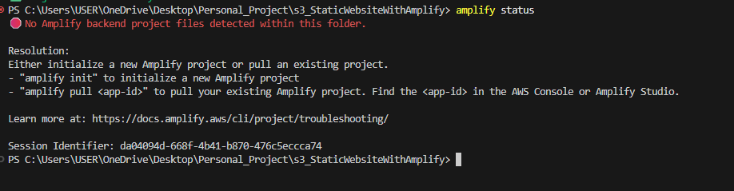


Trying to Access the Website After Deletion:
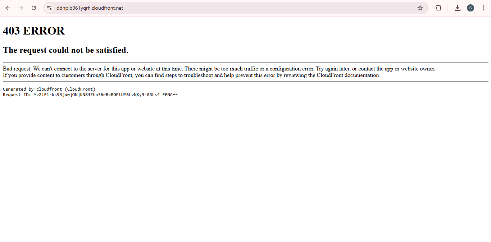


## Step 7: Initialize Git in Your Project Folder

Make sure you’re in your project directory (the one that contains index.html, amplify/, and your README.md):

`git init`


This command creates a hidden .git folder that tracks changes in your project.

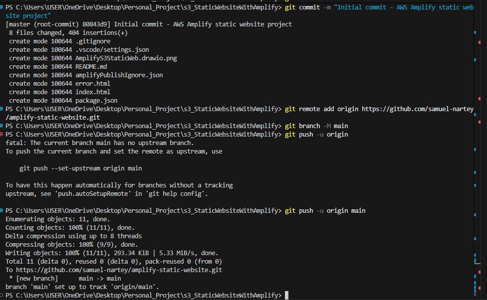


## Step 8: Check What Files Are Present

Run:

`git status`


You’ll see a list of untracked files (these are all your project files before you commit them).


This ensures sensitive or environment-specific files are not uploaded.


## Step 9: Stage Your Files

Add all files you want to track to Git:

`git add .`


This prepares them for the first commit.

## Step 10: Commit Your Files

`git commit -m "Initial commit - Amplify static website deployment"`


Now your project’s first snapshot is saved locally.

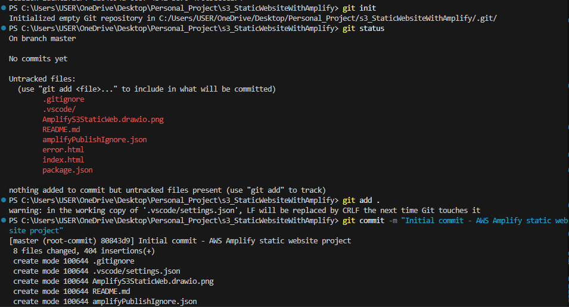


## Step 11: Create a New GitHub Repository

` Go to https://github.com/new `

Give it a name (e.g., amplify-static-website)

Add a description (e.g., “Static website hosted on AWS Amplify with S3 and CloudFront integration”)

Keep it Public if you want to share it

Don’t add a README or .gitignore — you already have them

Once created, GitHub will show you a page with commands like this:

```bash
git remote add origin https://github.com/<your-username>/amplify-static-website.git
git branch -M main
git push -u origin main
```


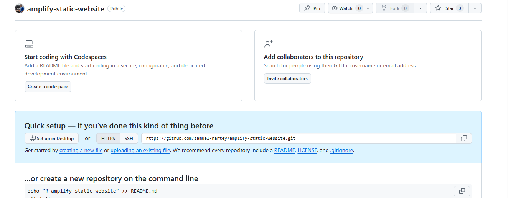


Run these commands exactly as shown (replace <your-username> with your actual GitHub username).

 ## Step 12: Push Your Project to GitHub

`git push -u origin main`


This uploads your entire project to GitHub.

Insert screenshot: GitHub repo showing files successfully uploaded.

## Step 13: Future Updates

Whenever you make changes (like editing index.html or updating your README):

```bash
git add .
git commit -m "Updated index.html content"
git push
```
This keeps your GitHub repo synced with your local changes.
---

##  Conclusion

You have successfully:

* Built and deployed a static website using **AWS Amplify Hosting**
* Understood how Amplify automates **S3** and **CloudFront** setup
* Learned the **deployment and delivery flow** behind AWS-managed static sites

---


---
